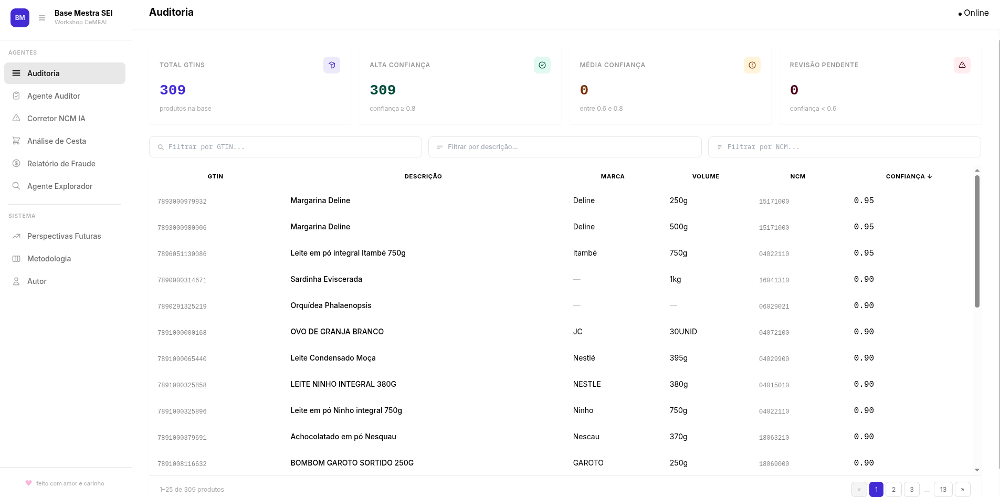
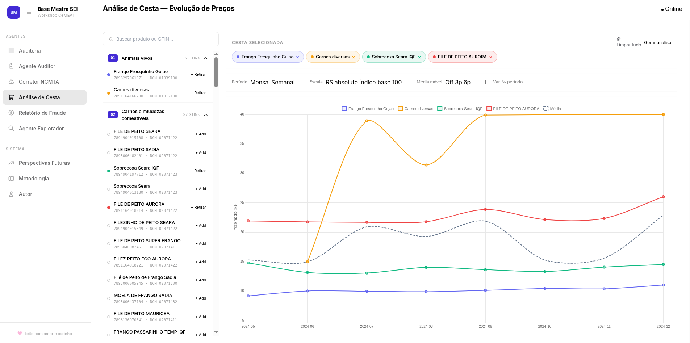
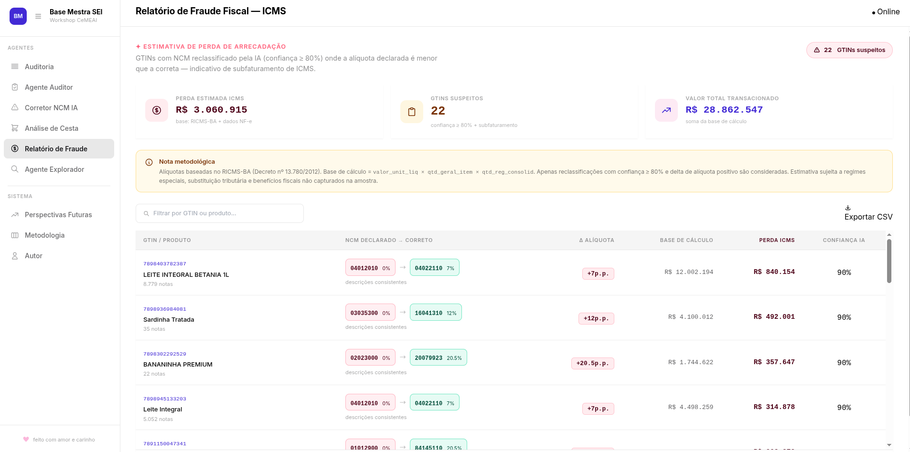
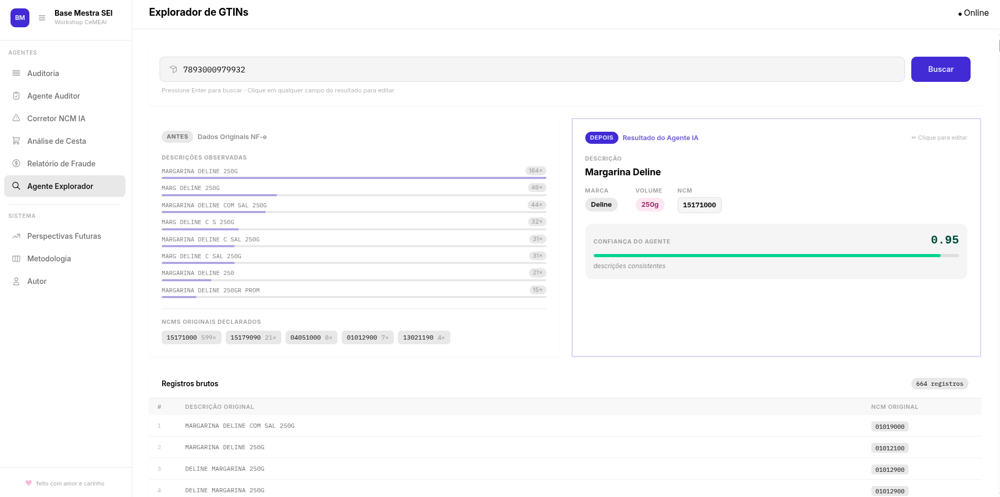

# Base Mestra — Padronização de Itens e Plataforma de Auditoria de NFC-e

> **Protótipo** desenvolvido no **Workshop CeMEAI 2026** em parceria com a
> **SEI-BA** (Superintendência de Estudos Econômicos e Sociais da Bahia)
> e a **SEFAZ-BA** (Secretaria da Fazenda do Estado da Bahia).

**Acesse:** [sei.edeilson.xyz](https://sei.edeilson.xyz)

---

## Protótipo

A seguir, algumas telas do protótipo da plataforma **Base Mestra**:

**Dashboard de auditoria**


**Análise de cesta básica**


**Relatório de fraude**


**Edição de registros**


---

## Contexto

O Estado da Bahia coleta dados de **Notas Fiscais Eletrônicas ao Consumidor
(NFC-e)** — o cupom fiscal digital emitido no varejo. Esse banco de dados
contém dezenas de milhões de registros de produtos vendidos em todo o estado,
sendo uma fonte rica para:

- Monitoramento de preços da **cesta básica** por município e período
- Análise de **inflação local** e isolamento logístico
- **Auditoria fiscal** e detecção de inconsistências de NCM
- Pesquisa econômica sobre padrões de consumo

---

## Deploy

**Acesse:** [sei.edeilson.xyz](https://sei.edeilson.xyz)

Push para `main` dispara deploy automático no Heroku via GitHub Actions.

> Configure os secrets `HEROKU_API_KEY` e `HEROKU_EMAIL` em
> **Settings → Secrets → Actions** no repositório GitHub.

---

## O Problema

As descrições dos produtos (`des_item`) são inseridas **livremente** pelos
emissores de NFC-e, gerando caos textual em escala:

```
"FARIN KICALDO BRANCA 1KG MAND"
"FARINHA DE MANDIOCA KICALDO 1KG"
"FARINHA BDE MANDIOCA KICALDO 1KG"
"FARINHA BRANCA FINA SECA 1 KG KICALDO"
```

Todas as linhas acima descrevem o **mesmo produto**. Sem padronização, é
impossível calcular preço médio, comparar regiões ou detectar anomalias.

O código **NCM** (Nomenclatura Comum do Mercosul) também não resolve
sozinho: agrupa produtos distintos sob o mesmo código e pode estar
incorreto no cadastro do emissor.

O **GTIN** (código de barras) é um âncora poderosa quando presente e
correto — mas precisa ser validado, pois pode estar ausente, zerado ou
preenchido erroneamente.

---

